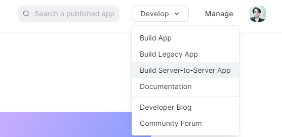
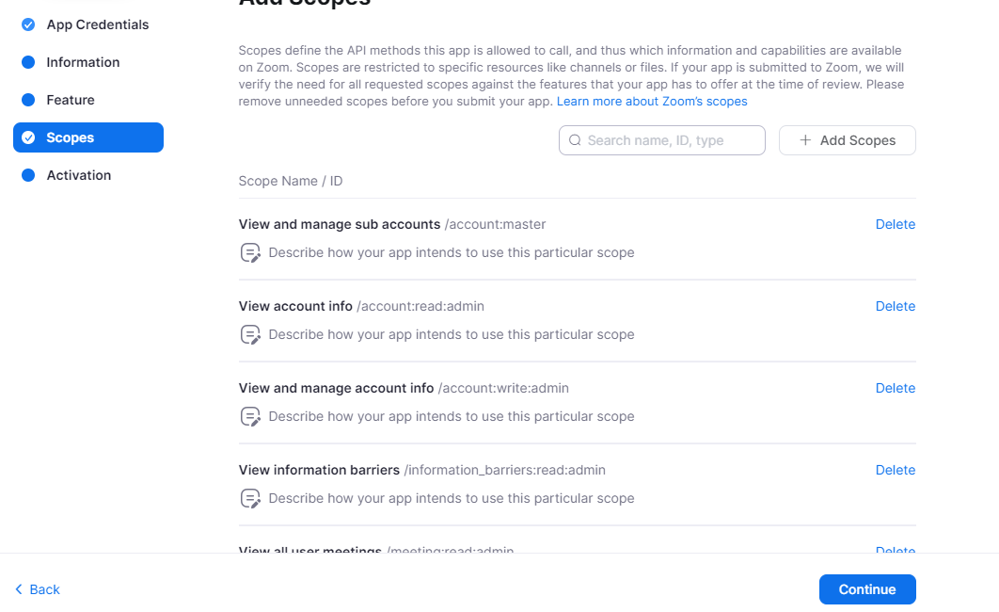
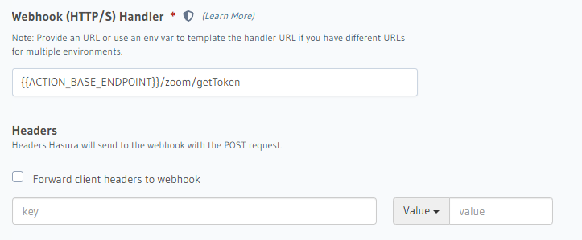
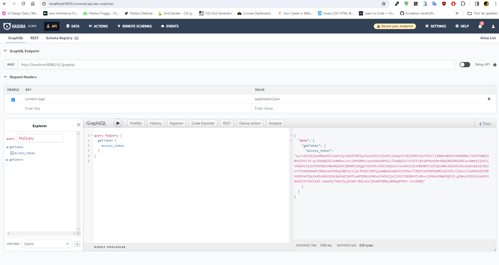
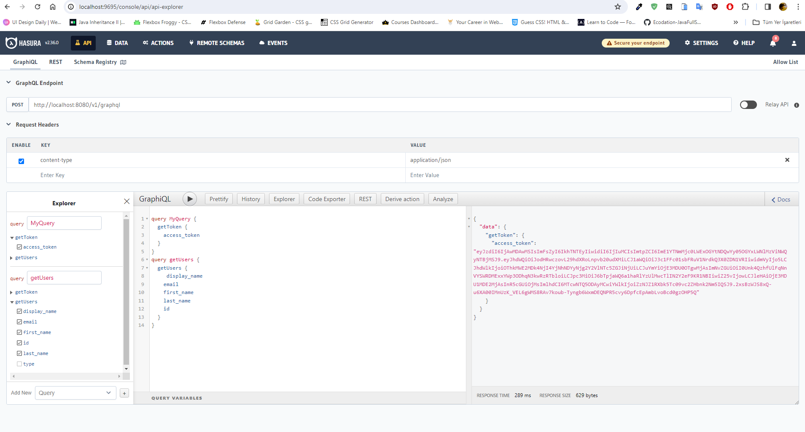
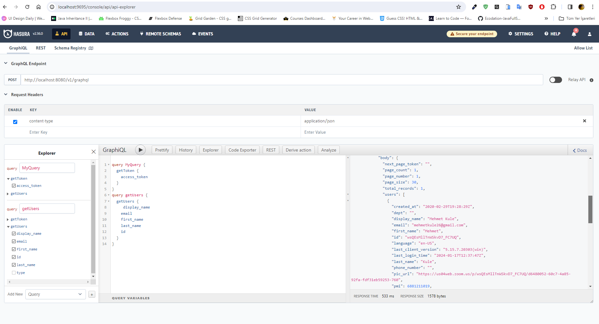

First clone the project. Go to the project directory and run the yarn or npm install command, then yarn start || Run the npm start command.

To access Zoom APIs
[Zoom Api](https://marketplace.zoom.us/) Go to the page and create an account, and then go to Build Server-to-Server App.
In order to use the API, you need to grant permissions and authorizations.

Get the Client ID and Client Secret information in the App Credentials section and add it to the .env file in the project directory.
Fill it in by following the steps on the left and then access the APIs.
Click the ``Add Scopes`` button in the Scopes section, mark the required fields and continue.

For detailed information about API, go to [Zoom Api](https://marketplace.zoom.us/docs/api-reference/zoom-api) page.

To run Hasura locally 
``cd hasura && docker-compose up``
run the command.

To access Hasura console, you must first install Hasura CLI.

[Hasura CLI](https://hasura.io/docs/latest/hasura-cli/install-hasura-cli/)

After installing the cli, go to the project directory and
``Run the cli command + init command in the project directory. then it will create the config file in the directory you specified. After the files are created, run the cli + console command in the directory where the config file is located. ``

For making requests and server communication via Hasura
`` ACTION_BASE ENDPOINT: http://host.docker.internal:3000 has been added to the docker-compose file. The server runs on port 3000. ``

On the Hasura Console screen
``
We need to specify the endpoint in the actions -> section.
``

 